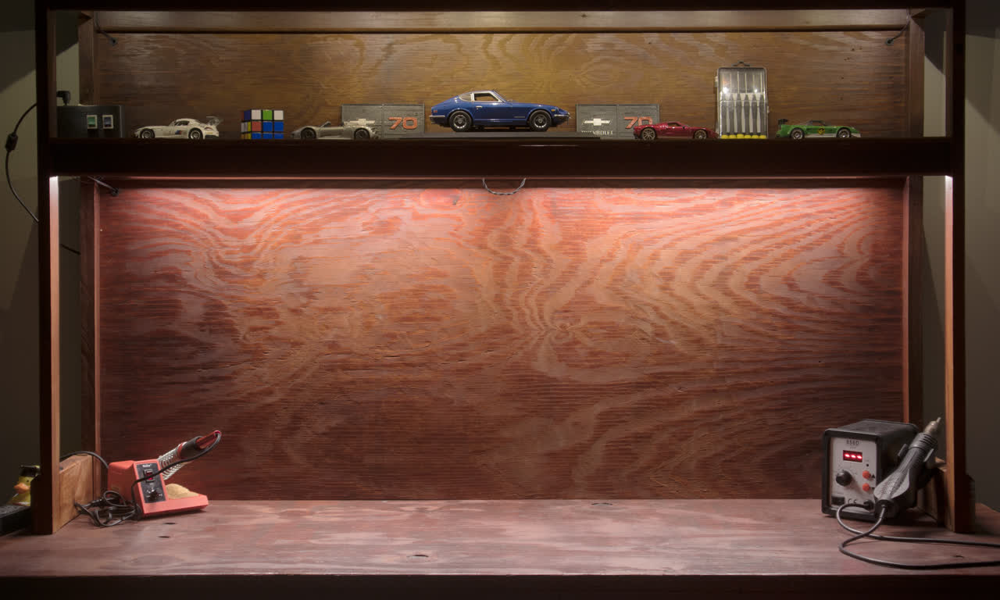
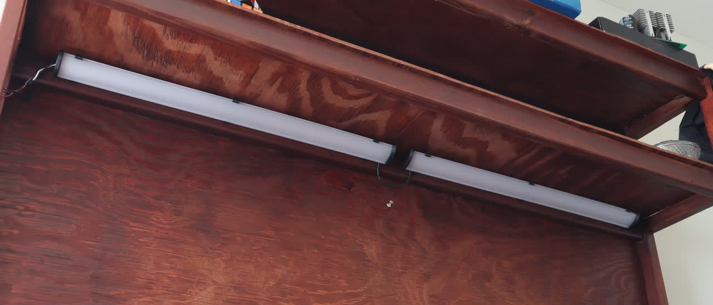
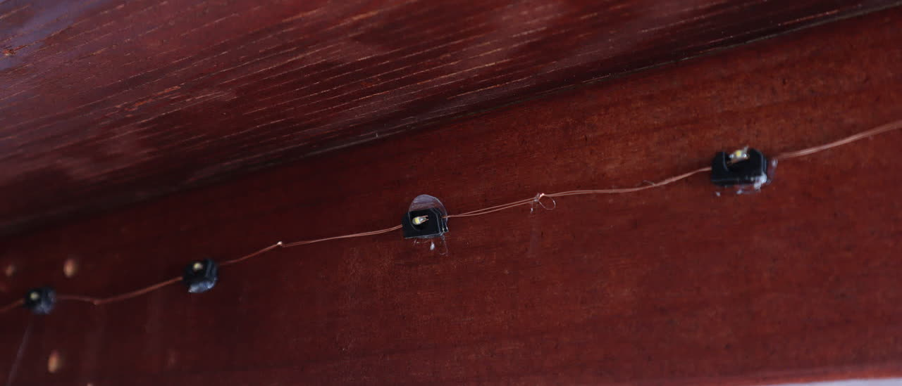
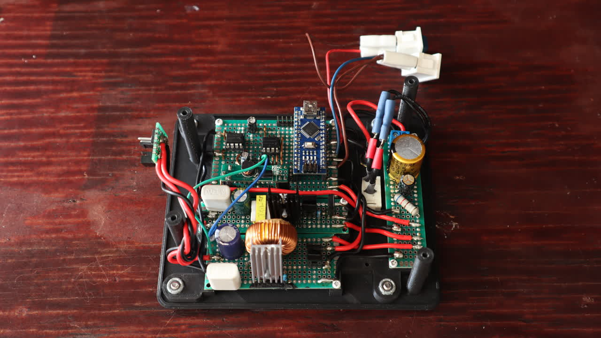
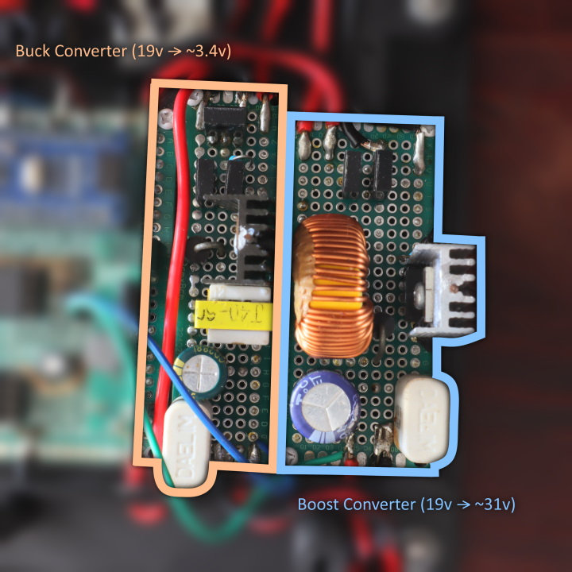
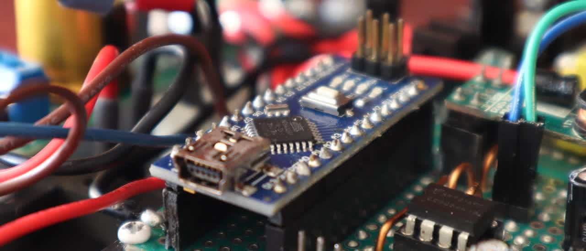
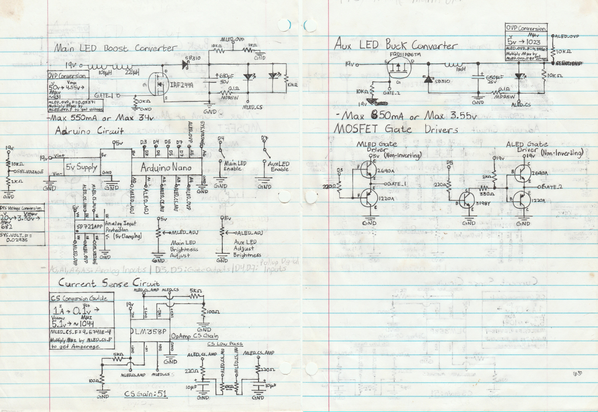

About a year ago, I wanted to have a workbench in my room so I can work on electrical projects without having to sit down or trade desk space on my computer setup. I asked my dad for his opinion on how to obtain one without breaking the bank, and he convinced to make one from scratch out of scrap wood and materials he had laying around. Indeed, building the table is a hard task, yet it was an opportunity for me to challenege myself on my designing and carpentry skills.

## Construction

To start, I designed the workbench. I drew a rough sketch of the table on paper while keeping in mind what materials (such as plywood and beams) I had available. Using this sketch, I created the final design in FreeCAD. It was the first time I attempted to design a wood project in CAD, yet I found that it is increadibly useful for visualizing the final project while also having the dimensions down at the same time.

After about a week on crafting the table full-time, it was finished. I am proud of the result considering the limitations of materials, and I am glad to see that the technique of using wooden dowels and glue to create seemless joints worked perfectly. For the final finish, I painted the entire desk with redwood stain from Home Depot using a paint gun. The paint gun helped with applying the stain equally across all surfaces, and it also enabled me to purposly over-apply on certain areas of the table to give them a gradient around the edges.

## Lighting

While it looks great, I wanted to add lights to the workbench so that the work area is well illuminated. I luckily had two broken LED fixtures that are meant to be installed in kitchen cabnets. Testing the LEDs by applying 31 volts results in them working with promising brightness, so luckily it is just the fixture frame that is broken, neat! I also had LED fairy lights that can illuminate the upper and lower deck of the table for extra flare.

Using my 3D printer, I fabricated mounts for the LEDs. For the cabinet (main) LEDs, I simply designed a bracket that mimics the original fixture's profile that supported the LED and diffuser. To protect the ends of the diffuser, I made caps that fit snuggly at the end of it. For the fairy lights, I designed a simple bracket to where a single LED slides into it as such in the photo.

## Circuitry

After mounting the LEDs, I spent two weeks researching, testing, and designing circuits the will drive them.

The simplest way to control voltage is to directly send the PWM to the lights, but there are two problems to this. First of all, PWM actuated lights are flickery and are uneasy on the eye. Secondly, the input voltage for the entire system is 19v (supplied by a 60w laptop charger). Thus 19v isn't enough for the main LEDs which have ~31v forward voltage for decent brightness, and 19v is way too much for the auxilary LEDs which require ~3.4v voltage.

To resolve this problem, the circuitry is using one boost converter (for increasing voltage) and one buck converter (for reducing voltage). These converters control the main and auxilary LEDs respectively. These are perfect for the lights because they output a steady voltage (so no flickering), and they can control thier output voltage via adjusting the duty cycle.

The lighting circuitry is controlled by the Arduino Nano development board which uses the ATmega328P microcontroller. Thanks to the Arduino development kit, programming the microcontroller is easy because it contains easy to use functions to control the I/O pins.

Its main job is to produce a PWM signal to the two voltage output channels to control the brightness of the lights, and furthermore, it has protections against overvoltage and high PWM duty cycles to the circuits.

After concluding research and testing, I made the final design of the entire circuit including the Arduino. In the final schematic, the brightness (voltage) of each channel can be adjusted via thier respective potentiometers, and they also be disabled by flicking thier respective switches aswell.

From what you've seen in the previous photos, the circuity is created entirely on protoboards. All the elctrical components are recycled out of old or unused electronics, and this made the cost of building the circuit essentially free. To properly plan the layout and wiring of it, I printed a scaled-up version of the purfboard on paper, and I sketched the components and wires following the grid of the board. I realized that planning prior to soldering is incredibly important, for the resulting complexity of the circuits makes it hard to place and wire everything on the spot.

## Programming the Arduino

Programming the Arduino is cruicial for bringing the circuits to life. I simply used the Arduino IDE and SDK functionality ease of use of interfacing the microcontroller